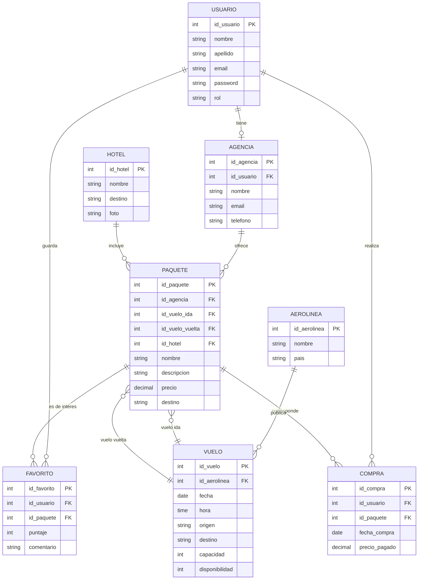

# 2026c2-pdes-grupo-nro-

### Diagrama de Entidad de Relación

```mermaid
erDiagram
    USUARIO ||--o| AGENCIA : "tiene"
    AGENCIA ||--o{ PAQUETE : "ofrece"

    USUARIO ||--o{ FAVORITO : "guarda"
    PAQUETE ||--o{ FAVORITO : "es de interes"

    USUARIO ||--o{ COMPRA : "realiza"
    PAQUETE ||--o{ COMPRA : "corresponde"

    HOTEL ||--o{ PAQUETE : "incluye"

    AEROLINEA ||--o{ VUELO : "publica"
    PAQUETE }o--|| VUELO : "vuelo ida"
    PAQUETE }o--|| VUELO : "vuelo vuelta"


    USUARIO {
        int id_usuario PK
        string nombre
        string apellido
        string email
        string password
        string rol
    }

    AGENCIA {
        int id_agencia PK
        int id_usuario FK
        string nombre
        string email
        string telefono
    }

    PAQUETE {
        int id_paquete PK
        int id_agencia FK
        int id_vuelo_ida FK
        int id_vuelo_vuelta FK
        int id_hotel FK
        string nombre
        string descripcion
        decimal precio
        string destino
    }

    HOTEL {
        int id_hotel PK
        string nombre
        string destino
        string foto
    }

    FAVORITO {
        int id_favorito PK
        int id_usuario FK
        int id_paquete FK
        int puntaje
        string comentario
    }

    COMPRA {
        int id_compra PK
        int id_usuario FK
        int id_paquete FK
        date fecha_compra
        decimal precio_pagado
    }

    AEROLINEA {
        int id_aerolinea PK
        string nombre
        string pais
    }

    VUELO {
        int id_vuelo PK
        int id_aerolinea FK
        date fecha
        time hora
        string origen
        string destino
        int capacidad
        int disponibilidad
    }
```

### Integrantes

- Manchali, Damian
- Qualia, Ezequiel
- García, Axel
